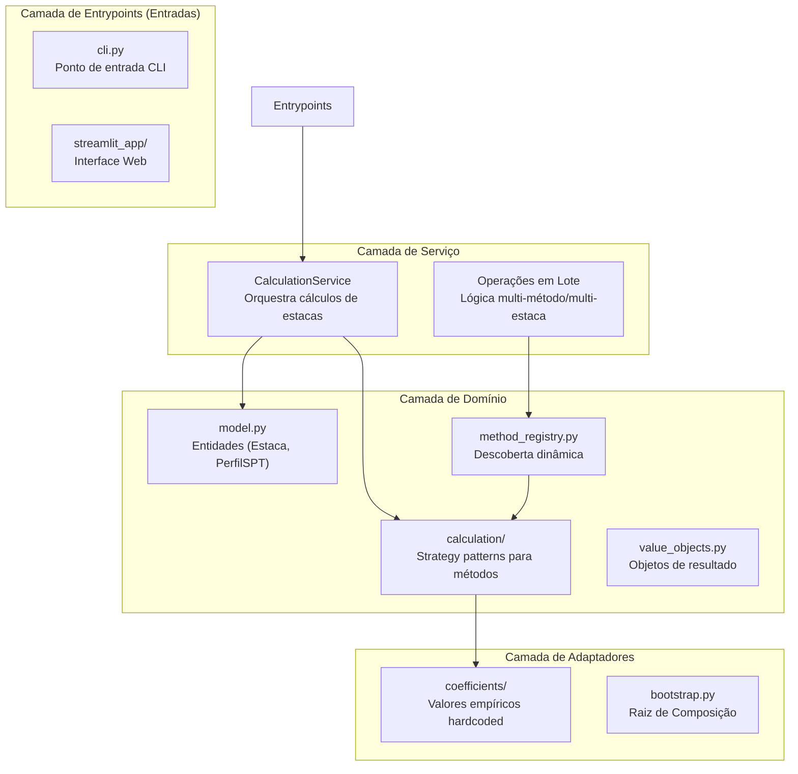
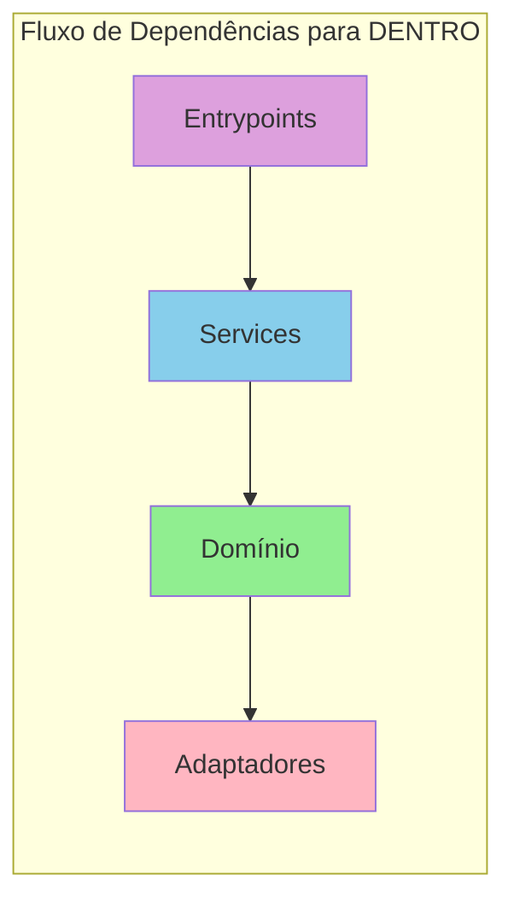

# Calculus-Core - Guia de Arquitetura

Este documento explica a arquitetura do projeto `calculus-core`, projetado seguindo os princípios do **Cosmic Python** (Architecture Patterns with Python) para garantir modularidade, testabilidade e manutenibilidade.

## Visão Geral

A base de código está organizada em quatro camadas distintas, cada uma com uma única responsabilidade:



---

## Responsabilidades das Camadas

### 1. Camada de Domínio (`domain/`)

**O coração da aplicação, contendo a lógica de negócio e regras de engenharia de fundações.**

| Caminho | Conteúdo |
|------|----------|
| `model.py` | Entidades principais como `Estaca` e `PerfilSPT`. |
| `calculation/` | Implementações de estratégias para diferentes métodos de cálculo (Aoki-Velloso, Decourt-Quaresma, etc.). |
| `method_registry.py` | Registro para descoberta dinâmica e instanciação de métodos de cálculo. |
| `value_objects.py` | Objetos imutáveis como `ResultadoCalculo`. |

**Princípio chave**: Esta camada deve ter dependências mínimas em bibliotecas externas. Ela representa o conhecimento de engenharia.

---

### 2. Camada de Adaptadores (`adapters/`)

**Faz a ponte entre o domínio e sistemas externos ou dados estáticos.**

| Caminho | Propósito |
|------|---------|
| `coefficients/` | Coeficientes empíricos (ex: K e alpha para Aoki-Velloso) usados pelos métodos de cálculo. |
| `bootstrap.py` | A **Raiz de Composição** (Composition Root) onde todas as dependências são conectadas. |

**Princípio chave**: Os adaptadores fornecem os dados e a configuração necessários pelo domínio.

---

### 3. Camada de Serviço (`service_layer/`)

**Orquestra as operações de domínio e fornece uma API limpa para os entrypoints.**

| Arquivo | Propósito |
|------|---------|
| `services.py` | `CalculationService` - coordena o ciclo de vida de uma requisição de cálculo. |

**Princípio chave**: Os serviços não contêm lógica de negócio; eles dizem aos objetos de domínio o que fazer.

---

### 4. Camada de Entrypoints (`entrypoints/`)

**Interfaces externas para a aplicação.**

| Caminho | Propósito |
|------|---------|
| `cli.py` | Interface via terminal. |
| `streamlit_app/` | Interface web moderna para cálculos interativos e visualização. |

**Princípio chave**: Entrypoints são camadas finas (thin wrappers) que chamam a Camada de Serviço.

---

## Fluxo de Dependência



- **Domínio** está no centro.
- **Serviços** dependem do Domínio.
- **Entrypoints** dependem dos Serviços.
- **Bootstrap** (em Adaptadores/Raiz) conecta tudo.

---

## Estratégia de Testes

| Tipo de Teste | O quê | Destino |
|-----------|------|--------|
| **Unitário** | Lógica de domínio e objetos de valor | `tests/unit/` |
| **Integração** | Camada de serviço e adaptadores | `tests/integration/` |
| **E2E (Ponta a Ponta)** | Fluxos completos da aplicação (CLI/Web) | `tests/e2e/` |

---

## Referência de Arquivos

```
src/calculus_core/
├── bootstrap.py            # Raiz de Composição (Composition Root)
├── domain/                 # Lógica de Negócio
│   ├── calculation/        # Implementações de métodos
│   ├── method_registry.py  # Descoberta de serviços
│   ├── model.py            # Entidades
│   └── value_objects.py    # VO
├── service_layer/          # Orquestração de Casos de Uso
│   └── services.py         # Serviços da Aplicação
├── adapters/               # Pontes Externas/Dados
│   └── coefficients/       # Dados empíricos
└── entrypoints/            # UIs (Interfaces)
    ├── cli.py              # Linha de Comando
    └── streamlit_app/      # App Web
```
